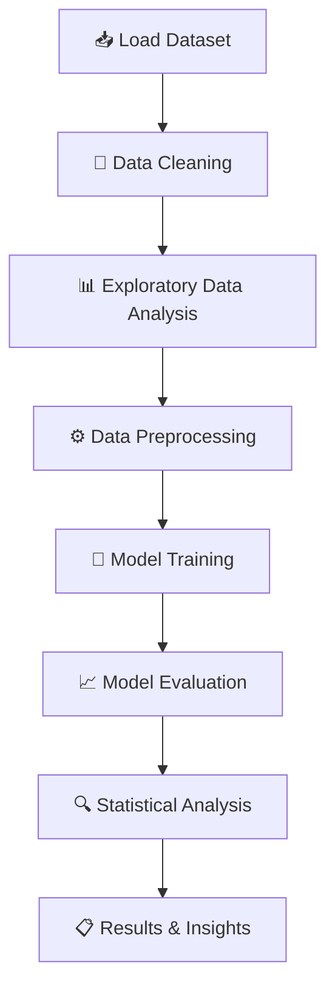
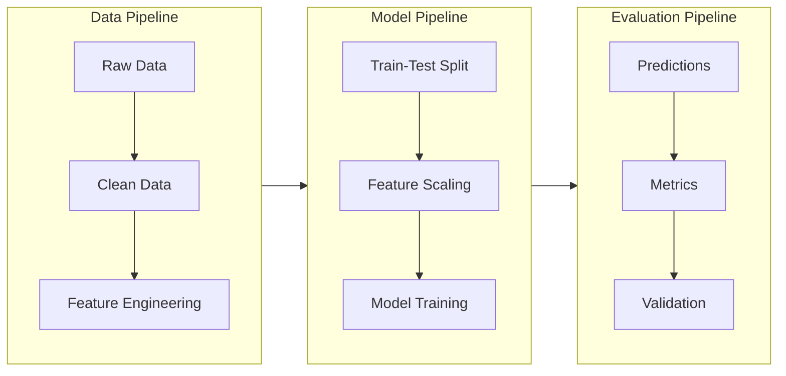
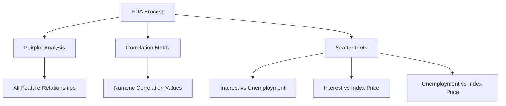
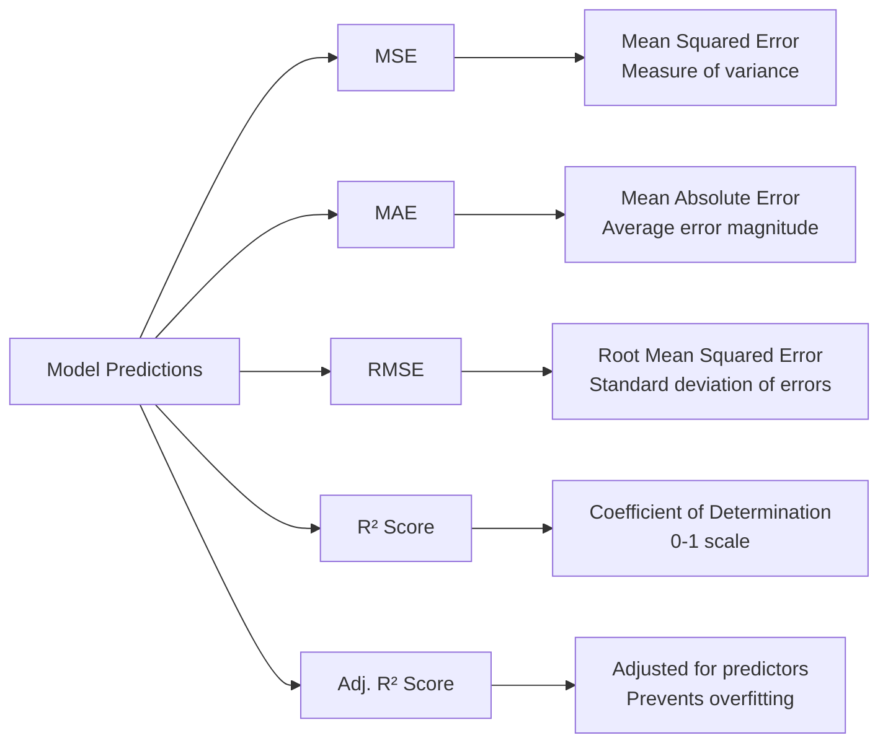
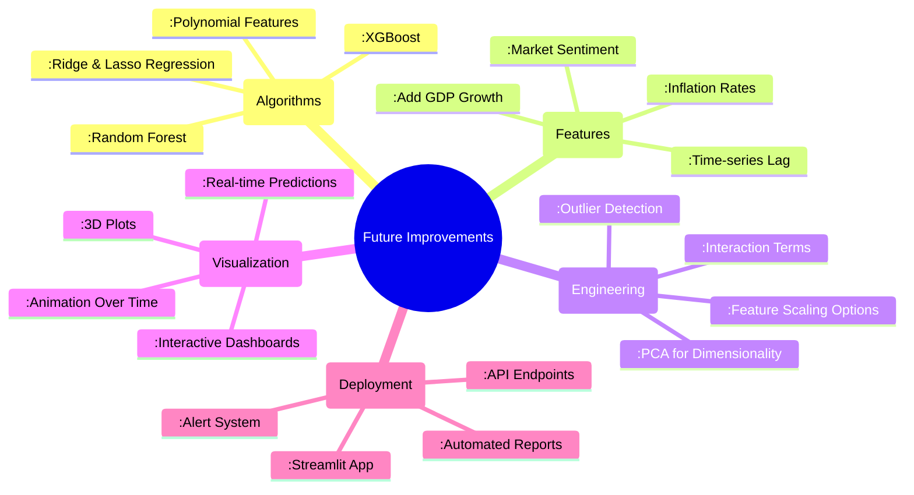

# 📊 Economic Index Prediction - Linear Regression Analysis

## 🎯 Project Overview
This project implements a **linear regression model** to predict economic index prices based on **interest rates** and **unemployment rates**. The analysis provides insights into how macroeconomic indicators influence market performance.



## 📁 Dataset Information
| Feature | Type | Description | Impact |
|---------|------|-------------|---------|
| `interest_rate` 📈 | Independent | Central bank lending rate | Negative correlation with index |
| `unemployment_rate` 👥 | Independent | Percentage of unemployed workforce | Negative correlation with index |
| `index_price` 💰 | Dependent | Economic market index value | Target variable |

**Dataset Source**: `Dataset/economic_index.csv`

## 🏗️ Project Architecture



## 🔧 Implementation Steps

### 1️⃣ **Data Preparation & Cleaning** 🧹
```python
# Removed unnecessary columns
df.drop(columns=["Unnamed: 0", "year", "month"], inplace=True)
```

### 2️⃣ **Exploratory Data Analysis** 📊


**Key Visualizations Created:**
- 📌 **Pairplot** - All variable relationships
- 🔗 **Correlation Heatmap** - Feature interrelationships  
- ✨ **Regression Plots** - Interest Rate vs Index Price
- 📉 **Scatter Plot** - Interest vs Unemployment Rate

### 3️⃣ **Data Preprocessing** ⚙️
```python
# Standardization Process
scaler = StandardScaler()
X_train_scaled = scaler.fit_transform(X_train)
X_test_scaled = scaler.transform(X_test)
```

### 4️⃣ **Model Training** 🤖
**Algorithm**: Linear Regression
- **Validation**: 3-fold Cross Validation ✅
- **Train-Test Split**: 75%-25% 📊
- **Random State**: 42 (for reproducibility) 🔒

### 5️⃣ **Model Evaluation Metrics** 📈



### 6️⃣ **Residual Analysis** 🔍
- ✅ **KDE Plot** of residuals to check normality
- 📊 **Distribution Analysis** of prediction errors
- 🎯 **Model Diagnostics** using statsmodels

## 🔑 Key Insights & Findings

### 📈 **Relationship Discoveries:**
1. **Interest Rate 📈 → Index Price 📉** (Inverse Relationship)
2. **Unemployment Rate 👥 → Index Price 📉** (Inverse Relationship)
3. **Interest Rate 📈 → Unemployment Rate 👥** (Positive Correlation)

### ⚡ **Model Coefficients:**
```
Interest Rate Coefficient: [Your Value]
Unemployment Rate Coefficient: [Your Value]
```
*Positive coefficients indicate positive impact, negative coefficients indicate negative impact*

## 🚀 Future Enhancements



### 🎯 **Immediate Improvements:**
1. **Feature Engineering** 🛠️
   - Add interaction terms between interest and unemployment rates
   - Create polynomial features (quadratic, cubic)
   - Include economic indicator ratios

2. **Advanced Models** 🧠
   - Ridge/Lasso Regression for regularization
   - Support Vector Regression (SVR)
   - Ensemble methods (Random Forest, Gradient Boosting)

3. **Enhanced Validation** ✅
   - Time-series cross-validation
   - Hyperparameter tuning with GridSearchCV
   - Learning curves analysis

4. **Visualization Dashboard** 📱
   - Interactive plots with Plotly
   - Real-time prediction interface
   - Model comparison dashboard

## 🛠️ Technical Stack

| Category | Tools Used |
|----------|------------|
| **Data Manipulation** | Pandas, NumPy |
| **Visualization** | Matplotlib, Seaborn |
| **Machine Learning** | Scikit-learn |
| **Statistical Analysis** | Statsmodels |
| **Environment** | Jupyter Notebook |

---

**Requirements.txt:**
```
pandas>=1.3.0
numpy>=1.21.0
matplotlib>=3.4.0
seaborn>=0.11.0
scikit-learn>=0.24.0
statsmodels>=0.12.0
jupyter>=1.0.0

```
👍🏻
